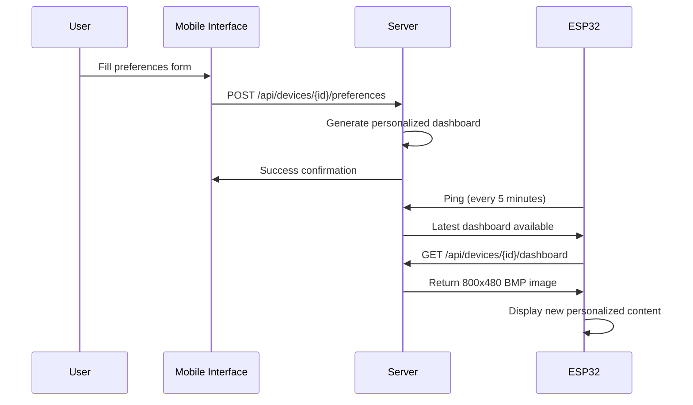

# ESP32-S3 E-ink Display Setup & Preference Management Guide

## 🔧 Hardware Setup

### ESP32-S3 to E-ink Display Connections

| E-Paper Pin | ESP32-S3 Pin | Function |
|-------------|--------------|----------|
| RST         | GPIO 4       | Reset |
| DC          | GPIO 5       | Data/Command |
| CS          | GPIO 6       | Chip Select |
| BUSY        | GPIO 7       | Busy Status |
| PWR         | GPIO 15      | Power Control |
| DIN/MOSI    | GPIO 11      | SPI Data |
| CLK/SCK     | GPIO 12      | SPI Clock |
| GND         | GND          | Ground |
| VCC         | 3.3V         | Power Supply |

## 📱 Initial Setup Process

### Step 1: Device First Boot
When ESP32-S3 boots for the first time:

1. **Fallback Image Display**: Shows default image with device ID
2. **WiFi Connection**: Attempts to connect using pre-configured credentials
   - SSID: `Mihirr`
   - Password: `12345678`
3. **Server Registration**: Automatically pings server to register device

### Step 2: User Configuration
Users access the mobile interface to set up preferences:

**Mobile Interface URL**: `http://192.168.120.63:5000/mobile/{device_id}`

**Configuration Fields**:
- 👤 **User Name**: Personal name (e.g., "John Doe")
- 💼 **Occupation**: Job title (e.g., "Software Engineer")
- 📱 **Device Name**: Custom device identifier
- 📶 **WiFi Settings**: Network credentials
- 📋 **Content Preferences**: Subcategory selections

## 🔄 Preference Update Flow

### How Preferences Are Updated

1. **User Input**: Customer fills out mobile interface form
2. **Data Submission**: Form sends POST request to `/api/devices/{device_id}/preferences`
3. **Server Processing**: 
   - Validates preferences
   - Stores in database with user profile
   - Generates new personalized dashboard
4. **Image Generation**: Server creates 800x480 BMP with:
   - User's name and occupation
   - Selected content (jokes, riddles, news)
   - Weather-style layout with cards
   - 1-bit monochrome with Floyd-Steinberg dithering

### ESP32 Automatic Updates

```cpp
// ESP32 checks for updates every 30 minutes
void loop() {
  // Periodic content refresh (every 30 minutes)
  static unsigned long lastRefresh = 0;
  if (millis() - lastRefresh > 1800000) {
    refreshContent();
    lastRefresh = millis();
  }
  
  // Periodic ping to server (every 5 minutes)
  static unsigned long lastPing = 0;
  if (millis() - lastPing > 300000) {
    sendPingToServer();
    lastPing = millis();
  }
}
```

## 🖼️ Image Processing Pipeline

### Server-Side Processing

1. **Content Generation**: Based on user's subcategory preferences
2. **Layout Creation**: Weather-style dashboard with user info
3. **Image Processing**:
   ```python
   # Resize to 800x480
   img_resized = img.resize((800, 480), Image.Resampling.LANCZOS)
   
   # Convert to grayscale
   img_gray = img.convert('L')
   
   # Apply Floyd-Steinberg dithering
   img_1bit = img_gray.convert('1', dither=Image.Dither.FLOYDSTEINBERG)
   ```

### Dashboard Layout Structure

```
┌─────────────────────────────────────────────────────────┐
│ Hello, John Doe!                    Monday, Sept 23, 2025│
│ Software Engineer                              2:30 PM   │
├─────────────────────────────────────────────────────────┤
│                                                         │
│ ┌─────────────────┐  ┌─────────────────┐              │
│ │ Quote of the Day│  │ Riddle of the Day│              │
│ │                 │  │                 │              │
│ │ "Programming is │  │ What gets wetter│              │
│ │ the art of..."  │  │ as it dries?    │              │
│ └─────────────────┘  └─────────────────┘              │
│                                                         │
│ ┌─────────────────────────────────────────────────────┐ │
│ │ Today's News                                        │ │
│ │ • New AI breakthrough in machine learning          │ │
│ │ • Climate change summit announces new initiatives  │ │
│ │ • Tech industry sees major merger announcement     │ │
│ └─────────────────────────────────────────────────────┘ │
│                                                         │
│ Device: ESP32S3_Device1        Updated: 2025-09-23 14:30│
└─────────────────────────────────────────────────────────┘
```

## 🔄 How Images Change After WiFi Setup

### Immediate After Configuration

1. **User Submits Form**: Mobile interface sends preferences to server
2. **Server Response**: Confirmation and immediate dashboard generation
3. **ESP32 Update**: Device gets new image within 5 minutes (next ping cycle)

### Update Sequence



## 🎯 Content Personalization

### User's Selected Subcategories Affect:

- **Quote Section**: Draws from selected joke subcategories
- **Riddle Section**: Uses selected riddle difficulty levels
- **News Section**: Shows news from preferred topics
- **Header**: Displays user's name and occupation
- **Layout**: Optimized for 800x480 e-ink displays

### Example Preference Mapping

```json
{
  "user_name": "John Doe",
  "user_occupation": "Software Engineer",
  "jokes": ["programming_jokes", "dad_jokes"],
  "riddles": ["brain_teasers", "logic_puzzles"],
  "news": ["tech_news", "science_news"],
  "layout": "default"
}
```

Results in dashboard showing:
- Programming and dad jokes in quote section
- Brain teasers and logic puzzles in riddle section
- Tech and science news in news section
- "Hello, John Doe!" and "Software Engineer" in header

## 🛡️ Fallback System

### Fallback Images
- **Purpose**: Display when server is unreachable
- **Location**: `/fallback_images/ESP32S3_Device1_fallback.bmp`
- **Content**: Device ID and "Configuration Required" message

### Fallback Triggers
1. Server connection fails
2. Dashboard generation error
3. Network connectivity issues
4. Device not yet configured

## 🔧 Testing & Validation

### Test the Complete Flow

1. **Reset ESP32**: Fresh start
2. **Access Mobile Interface**: `http://192.168.120.63:5000/mobile/ESP32S3_Device1`
3. **Configure Preferences**: Fill all fields including name and occupation
4. **Wait for Update**: ESP32 updates within 5 minutes
5. **Verify Display**: Personalized content with user info

### API Testing

```bash
# Test preference update
curl -X POST http://192.168.120.63:5000/api/devices/ESP32S3_Device1/preferences \
  -H "Content-Type: application/json" \
  -d '{
    "user_name": "John Doe",
    "user_occupation": "Software Engineer",
    "jokes": ["programming_jokes"],
    "riddles": ["brain_teasers"],
    "news": ["tech_news"]
  }'

# Get generated dashboard
curl http://192.168.120.63:5000/api/devices/ESP32S3_Device1/dashboard \
  --output test_dashboard.bmp
```

This setup ensures your ESP32-S3 e-ink displays show personalized, regularly updated content based on each user's preferences and profile information!